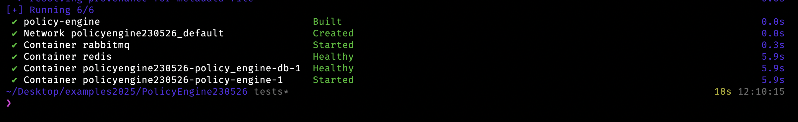
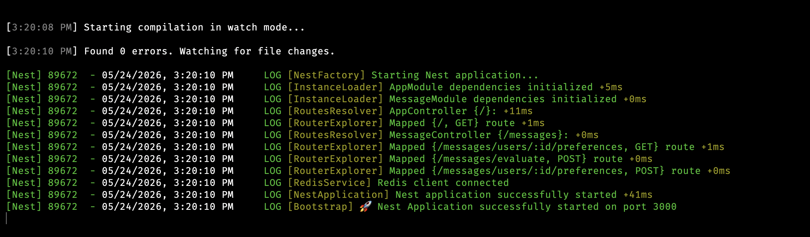

# Движок политик уведомлений

Это полноценный боевой микросервис, с проблеми: 
> работа с часовыми поясами (таймзоны),<br/> 
> глобальные политики блокировок,<br/> 
> логирование (Observability), <br/>
> идемпотентность и полное покрытие тестами.<br/>
	
**Главный фокус — на <u>качестве архитектуры</u>, типов, бизнес‑логики... Docker приветствуется... Форматы можно менять.**

## В чем суть задания? - В таймзонах 

Над решить проблему часовых поясов для того что бы пользователь живущий в Париже не получил сообщение в ночное время, а для жителя Москвы сообщение приходло с учетом временни по его региону. Простыми словами сообщения должны приходить с учетом часового пояса, не ночью а в рабочее время

**В данной работе будет разработка только backend стороны без работ на клиентской стороне.**

## Запуск сервиса:

1. В корне проекта находится файл окружения переименуйте его **.youreEnv** в **.env** и пропишите свои вводные
2. ```bash
   docker-compose up -d --build
   ```
   Для чего эта команда: Для запуска всего приложения через одну команду
   
   **результат выполнения команды из корня репозитрия**

   <p align="center">
  		
   </p>


4. ```bash
   npm run start:dev
   ```
   Запуск сервиса локально, только самого сервиса без запуска Docker
   
   **результат выполненя локальной команды из корня сервиса**
   
   <p align="center">
  		
   </p>

